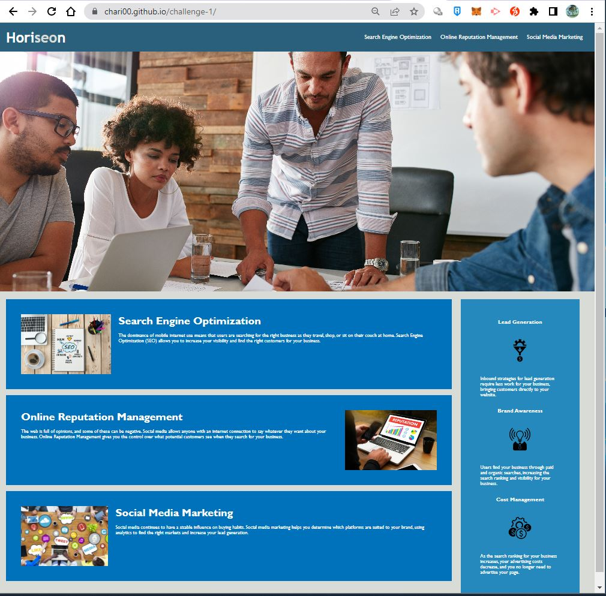

Repository contains quality README file with description, screenshot, and link to deployed application.

# Website Accessibility

## Description

This project is about website optimization and accessibility, for the users to easily navigate within the website by clicking some highlighted navigation bars. 

## Visual

## Usage

## Links

https://github.com/chari00/challenge-1
https://chari00.github.io/challenge-1/

## License

This project is licensed by MIT.

